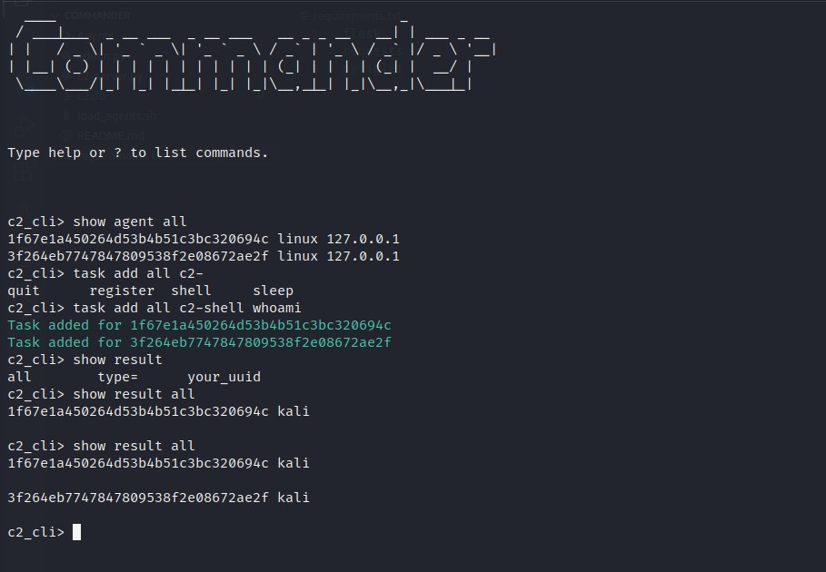
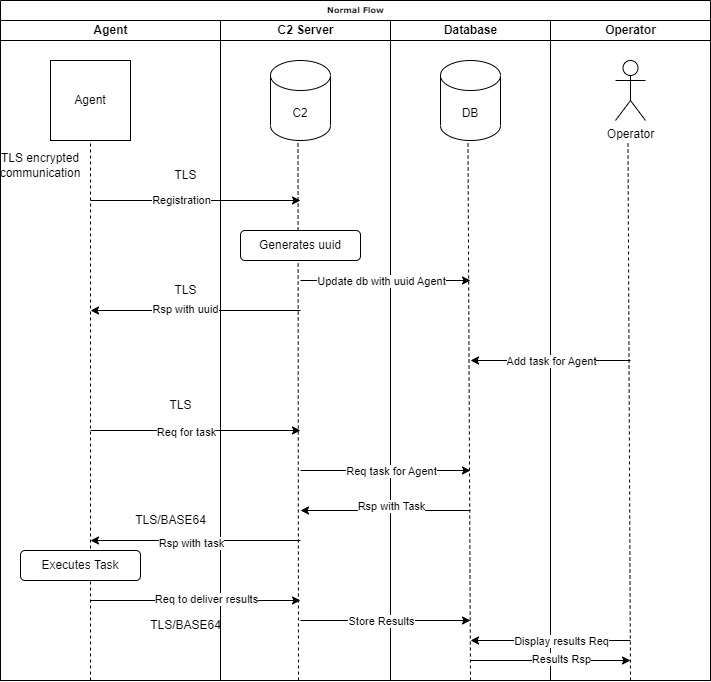
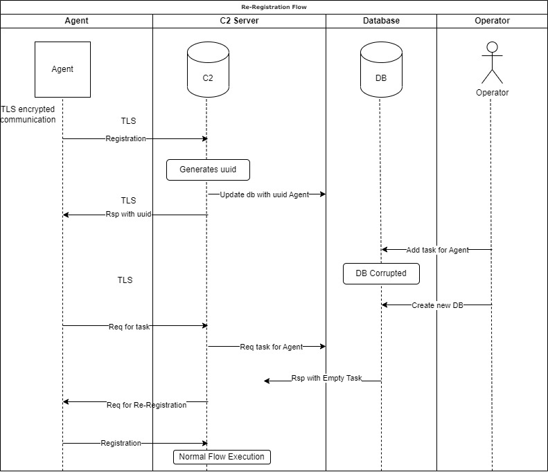

# Commander
Commander is a command and control framework (C2) written in Python, Flask and SQLite. It comes built-in with two Linux agents written in Python and C.

### Features
- Fully encrypted communications (TLS)
- Base64 data encoding
- RESTful API
- Supports CLI Clients
- Comes with a built-in Agent written in C for small footprint

### Agents
- Python 3
- C

### Requirements
Python >= 3.6 is required to run and the following dependencies
```
Linux
apt install libcurl4-openssl-dev libb64-dev
pip3 install -r requirements.txt
```

## Preview


## How to Use it
Start the admin.py module first in order to create a local sqlite db file
```
python3 admin.py
```
Continue by running the server
```
python3 c2_server.py
```
And last the agent. For the python case agent you can just run it but in the case of the C agent you need to compile it first.
```
# python agent
python3 agent.py

# C agent
gcc agent.c -o agent -lcurl -lb64
./agent
```

By default both the Agents and the server are running over TLS and base64. The communication point is set to 127.0.0.1:5000 and in case a different point is needed it should be changed in Agents source files.

As the Operator/Administrator you can use the following commands to control your agents 
```
Commands:

  task add arg c2-commands
    Add a task to an agent, to a group or on all agents.
    arg: can have the following values: 'all' 'type=linux|windows' 'your_uuid' 
    c2-commands: possible values are c2-register c2-shell c2-sleep c2-quit
      c2-register: Triggers the agent to register again.
      c2-shell: It takes an shell command for the agent to execute. eg. c2-shell whoami
      c2-sleep: Configure the interval that an agent will check for tasks.
      c2-quit: Forces an agent to quit.

  task delete arg
    Delete a task from an agent or all agents.
    arg: can have the following values: 'all' 'type=linux|windows' 'your_uuid' 
  show agent arg
    Displays info for all the availiable agents or for specific agent.
    arg: can have the following values: 'all' 'type=linux|windows' 'your_uuid' 
  show task arg
    Displays the task of an agent or all agents.
    arg: can have the following values: 'all' 'type=linux|windows' 'your_uuid' 
  show result arg
    Displays the history/result of an agent or all agents.
    arg: can have the following values: 'all' 'type=linux|windows' 'your_uuid' 
  find active agents
    Drops the database so that the active agents will be registered again.

  exit
    Bye Bye!
```

Special attention should be given to the 'find active agents' command. This command deletes all the tables and creates them again. It might sound scary but it is not, at least that is what i believe :P 

The idea behind this functionality is that the c2 server can request from an agent to re-register at the case that it doesn't recognize him.
So, since we want to clear the db from unused old entries and at the same time find all the currently active hosts we can drop the tables and trigger the re-register mechanism of the c2 server. See below for the re-registration mechanism.

### Flows
Below you can find a normal flow diagram
##### Normal Flow



In case where the environment experiences a major failure like a corrupted database or some other critical failure the re-registration mechanism is enabled so we don't lose our connection with our agents.

More specifically, in case where we lose the database we will not have any information about the uuids that we are receiving thus we can't set tasks on them etc... So, the agents will keep trying to retrieve their tasks and since we don't recognize them we will ask them to register again so we can insert them in our database and we can control them again.

Below is the flow diagram for this case.



**Disclaimer**: This tool is only intended to be a proof of concept demonstration tool for authorized security testing. Running this tool against hosts that you do not have explicit permission to test is illegal. You are responsible for any trouble you may cause by using this tool.
